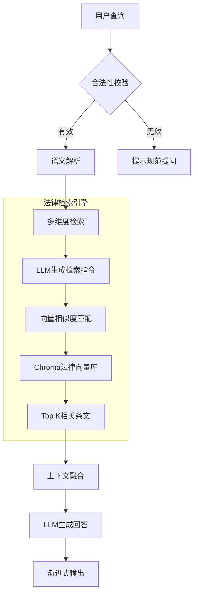

  

# 法律RAG智能检索系统

基于LangChain架构构建的法律领域检索增强生成系统，深度整合200+部法律法规文本与大语言模型能力，实现精准的法律条文检索与专业解答生成。采用向量数据库+LLM双引擎架构，支持流式响应输出。

## 在线体验
[https://law.vmaig.com/](https://law.vmaig.com/)

⚠️ 访问凭证：
- 用户名：`username`
- 密码：`password`

## 核心原理

### 系统架构

flowchart LR
    A[法律文本加载] --> B[章节结构化解析]
    B --> C[递归文本分块]
    C --> D[语义向量编码]
    D --> E[Chroma向量存储]

### 环境准备
# 创建配置文件
cp .env.example .env && vim .env

# 创建虚拟环境
python -m venv ~/.venvs/legal-rag
source ~/.venvs/legal-rag/bin/activate

# 安装依赖
pip install -r requirements.txt

###初始化与交互
# 构建法律向量库（首次运行必选）
python manager.py --init-db

# 启动Web服务
python manager.py --web

### 系统配置

通过修改`config.py`文件，可以调整以下核心参数：

| 参数                | 说明                          | 默认值       |
|---------------------|-----------------------------|-------------|
| `LAW_RETRIEVAL_K`   | 法律条文检索数量              | 3           |
| `WEB_HOST`          | Web服务监听地址              | 0.0.0.0     |
| `WEB_PORT`          | Web服务端口                  | 7860        |
| `AUTH_USERNAME`     | 访问用户名                   | username    |
| `AUTH_PASSWORD`     | 访问密码                     | password    |

### 功能特性

| 特性         | 描述                                                                 |
|--------------|----------------------------------------------------------------------|
| **智能检索** | 基于Sentence-BERT的语义向量匹配，支持多粒度法律条文检索                     |
| **上下文感知** | 采用Multi-Query Retriever机制提升检索召回率                               |
| **安全合规** | 内置查询合法性校验模块，拒绝非法律领域查询                                 |
| **响应优化** | 支持流式输出和渐进式回答生成                                             |

